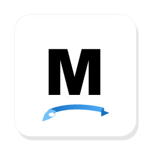

<p align="center">
  
</p>

# Modraw

English | [简体中文](./README_zh.md)

Modraw is a desktop hand-drawn style whiteboard app inspired by Excalidraw. It is built with Electron, React, Vite, Zustand, Rough.js, and Tailwind CSS.

## Features

- Full-canvas editing surface with floating controls
- Floating Modraw menu in the top-left corner
- Floating drawing toolbar centered at the top
- Floating zoom, undo, and redo controls in the bottom-left corner
- Rectangle, diamond, ellipse, arrow, line, free draw, text, image, and frame tools
- Tool lock mode: keep the selected drawing tool after creating an element
- Frame tool: group contained elements and move them with the frame
- Live move, resize, rotate, and point editing interactions
- Editable points for arrows and lines, with right-click point insertion
- Property panels for shapes, arrows, lines, free draw, and text
- Whiteboard and grid canvas background switching
- Image import from local files
- Save and open `.mdr` canvas files
- Export to PNG and SVG
- Reset canvas with confirmation
- English and Simplified Chinese UI switching
- Custom application icon

## Getting Started

Install dependencies:

```bash
npm install
```

Run in development mode:

```bash
npm run dev
```

Build production output:

```bash
npm run build
```

Preview the built app:

```bash
npm run preview
```

## Packaging

Modraw uses `electron-builder` to package desktop installers. Build output is written to the `release/` directory.

Create an unpacked app directory for local verification:

```bash
npm run pack
```

Build the default installer for the current platform:

```bash
npm run dist
```

Build a Windows NSIS installer:

```bash
npm run dist:win
```

Windows installer output:

```text
release/Modraw-1.0.0-Setup-x64.exe
```

Packaging notes:

- The app icon is configured from `build/icon.ico`.
- `npm run dist:win` runs `electron-vite build` first, then creates the installer.
- Code signing is not configured in this version. Windows may show an unknown publisher warning.
- Windows executable signing/editing is disabled in `package.json` to avoid local symlink privilege issues during unsigned packaging.
- The installer allows users to choose the installation directory and creates desktop/start menu shortcuts.

## Usage

- Use the centered floating toolbar to select drawing tools.
- Use the lock button at the beginning of the toolbar to decide whether the current tool remains active after drawing.
- Use the top-left Modraw menu to create, open, save, reset, export, switch language, or switch canvas background.
- Select an element to show its property panel.
- Right-click arrows or lines to add an editable point.
- Draw a frame around elements to bind them to the frame; moving the frame moves the contained elements together.
- Use the bottom-left floating bar to zoom, undo, and redo.

## Keyboard Shortcuts

| Shortcut | Action |
| --- | --- |
| `1` | Select |
| `2` | Rectangle |
| `3` | Diamond |
| `4` | Ellipse |
| `5` | Arrow |
| `6` | Line |
| `7` | Free draw |
| `8` | Text |
| `9` | Image |
| `F` | Frame |
| `X` | Eraser |
| `H` | Hand |
| `Space` | Temporary hand tool |
| `Delete` / `Backspace` | Delete selected elements |
| `Esc` | Clear selection |
| `Ctrl/Cmd + Z` | Undo |
| `Ctrl/Cmd + Shift + Z` | Redo |
| `Ctrl/Cmd + N` | New canvas |
| `Ctrl/Cmd + =` | Zoom in |
| `Ctrl/Cmd + -` | Zoom out |
| `Ctrl/Cmd + 0` | Reset zoom |

## Project Structure

```text
src/
  main/       Electron main process
  preload/    Electron preload bridge
  renderer/   React renderer app

build/
  icon.ico    Windows app icon
  icon.png    Runtime window icon
  icon.svg    Source icon

assets/
  icon-concepts/  Icon concept drafts
```

Important renderer folders:

- `components/`: canvas, floating toolbar, menus, controls, and property panels
- `core/`: rendering, hit testing, export, persistence, and `.mdr` file helpers
- `stores/`: Zustand app and scene state
- `types/`: shared TypeScript types
- `i18n.ts`: English and Simplified Chinese translation dictionary

## Tech Stack

- Electron
- React
- Vite / electron-vite
- TypeScript
- Zustand
- Rough.js
- Tailwind CSS
- electron-builder

## File Format

Modraw saves canvases as `.mdr` files. The file stores scene data in JSON format so it can be reopened later for continued editing.

## Version Status

This README describes the current first-version desktop app. The app supports local drawing workflows, `.mdr` save/open, image import, export, frame grouping, bilingual UI, custom app icon, and Windows installer packaging. Collaboration, cloud sync, code signing, and advanced document management are not included yet.
